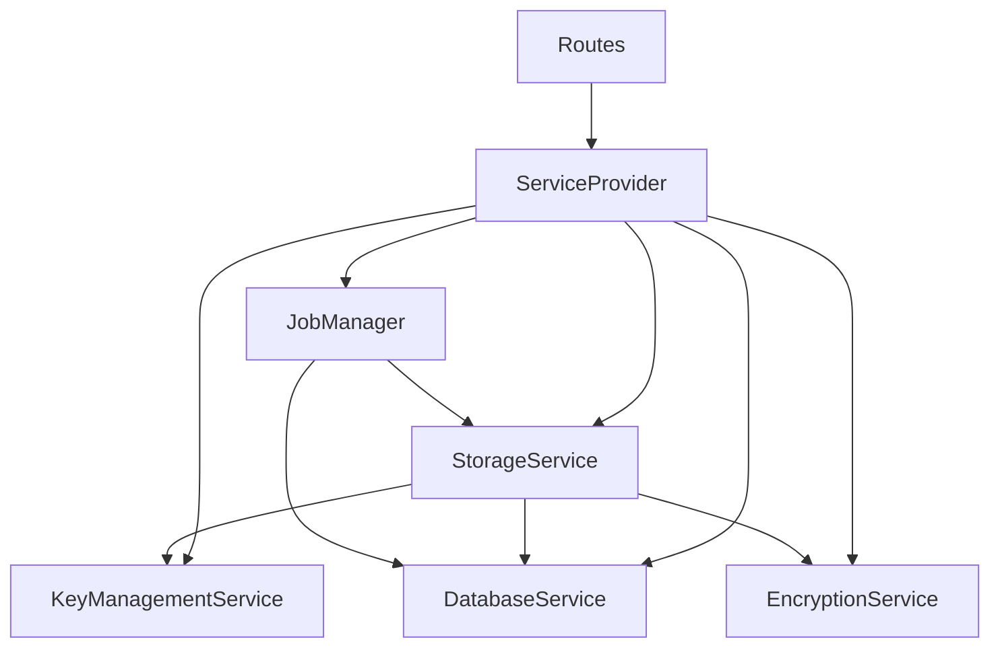

# API Documentation

## Architecture Overview

The system follows a service-oriented architecture with clear boundaries and dependencies:



### Key Components

1. Service Provider
   - Centralized service initialization
   - Dependency injection
   - Service validation
   - Interface-based design

2. Job Queue
   - PostgreSQL-based queue
   - Distributed locking with FOR UPDATE SKIP LOCKED
   - Real-time updates via NOTIFY/LISTEN
   - Worker health monitoring
   - Automatic job recovery

3. File Processing
   - Compression before encryption
   - End-to-end encryption
   - Secure key management
   - File sharing capabilities

## API Endpoints

### Files API

#### POST /api/v1/files/upload
Upload a file for transcription.

Request:
```http
POST /api/v1/files/upload HTTP/1.1
Content-Type: multipart/form-data

file: <file_data>
```

Response:
```json
{
  "id": "123e4567-e89b-12d3-a456-426614174000",
  "name": "recording.mp3",
  "status": "pending",
  "created_at": "2025-02-24T07:00:00Z"
}
```

#### GET /api/v1/files/{file_id}
Get file information.

Response:
```json
{
  "id": "123e4567-e89b-12d3-a456-426614174000",
  "name": "recording.mp3",
  "status": "completed",
  "created_at": "2025-02-24T07:00:00Z",
  "completed_at": "2025-02-24T07:05:00Z"
}
```

### Jobs API

#### GET /api/v1/jobs/{job_id}
Get job status and information.

Response:
```json
{
  "id": "123e4567-e89b-12d3-a456-426614174000",
  "file_name": "recording.mp3",
  "status": "processing",
  "progress": 0.5,
  "created_at": "2025-02-24T07:00:00Z"
}
```

#### GET /api/v1/jobs
List jobs with optional filtering.

Parameters:
- status: Filter by job status
- limit: Maximum number of jobs to return
- offset: Pagination offset

Response:
```json
{
  "jobs": [
    {
      "id": "123e4567-e89b-12d3-a456-426614174000",
      "file_name": "recording.mp3",
      "status": "completed",
      "progress": 1.0,
      "created_at": "2025-02-24T07:00:00Z",
      "completed_at": "2025-02-24T07:05:00Z"
    }
  ],
  "total": 1
}
```

#### POST /api/v1/jobs/{job_id}/cancel
Cancel a running job.

Response:
```json
{
  "id": "123e4567-e89b-12d3-a456-426614174000",
  "status": "cancelled",
  "cancelled_at": "2025-02-24T07:02:00Z"
}
```

#### POST /api/v1/jobs/{job_id}/retry
Retry a failed job.

Response:
```json
{
  "id": "123e4567-e89b-12d3-a456-426614174000",
  "status": "pending",
  "retry_count": 1
}
```

### Transcriptions API

#### GET /api/v1/transcriptions/{job_id}
Get transcription result.

Response:
```json
{
  "job_id": "123e4567-e89b-12d3-a456-426614174000",
  "text": "Transcribed text content...",
  "segments": [
    {
      "start": 0.0,
      "end": 5.2,
      "text": "First segment..."
    }
  ],
  "speakers": [
    {
      "id": "speaker_1",
      "segments": [0, 2, 4]
    }
  ],
  "language": "en",
  "duration": 300.5,
  "word_count": 150,
  "confidence": 0.95
}
```

### Keys API

#### GET /api/v1/keys/files/{file_id}/key
Get file encryption key.

Response:
```json
{
  "file_id": "123e4567-e89b-12d3-a456-426614174000",
  "owner_id": "user123",
  "encrypted_key": "base64_encoded_key",
  "created_at": "2025-02-24T07:00:00Z"
}
```

#### POST /api/v1/keys/files/{file_id}/shares/{user_id}
Share file key with another user.

Response:
```json
{
  "file_id": "123e4567-e89b-12d3-a456-426614174000",
  "user_id": "user456",
  "created_at": "2025-02-24T07:00:00Z"
}
```

## Error Handling

All endpoints follow a consistent error response format:

```json
{
  "code": "ERROR_TYPE",
  "message": "Human readable message",
  "details": {
    "field": "specific_field",
    "reason": "specific reason"
  }
}
```

Error Categories:
- 400: Validation errors
- 401: Authentication errors
- 403: Authorization errors
- 404: Resource not found
- 409: Resource conflicts
- 500: Internal server errors
- 503: Service unavailable

## Authentication

All endpoints except /auth require a valid JWT token:

```http
Authorization: Bearer <token>
```

Token claims:
```json
{
  "sub": "user123",
  "roles": ["user"],
  "exp": 1708747200
}
```

## Rate Limiting

Rate limiting has been removed in favor of worker-based concurrency control:
- Job processing is limited by available workers
- Workers claim jobs based on priority
- Failed jobs use exponential backoff
- Stale jobs are automatically recovered

## Metrics

Available Prometheus metrics:
- job_processing_duration_seconds
- job_queue_size
- job_retry_count
- storage_bytes
- db_connections

## Configuration

Required environment variables:
```bash
# Database
POSTGRES_PASSWORD=<password>

# Storage
MINIO_ACCESS_KEY=<access_key>
MINIO_SECRET_KEY=<secret_key>

# Optional with defaults
POSTGRES_HOST=localhost
POSTGRES_PORT=5432
MINIO_HOST=localhost
MINIO_PORT=9000
```

Service settings:
- Database pool: min=5, max=20
- Job timeout: 120 minutes
- Cleanup interval: 24 hours
- Max retries: 3
- Chunk size: 8MB
