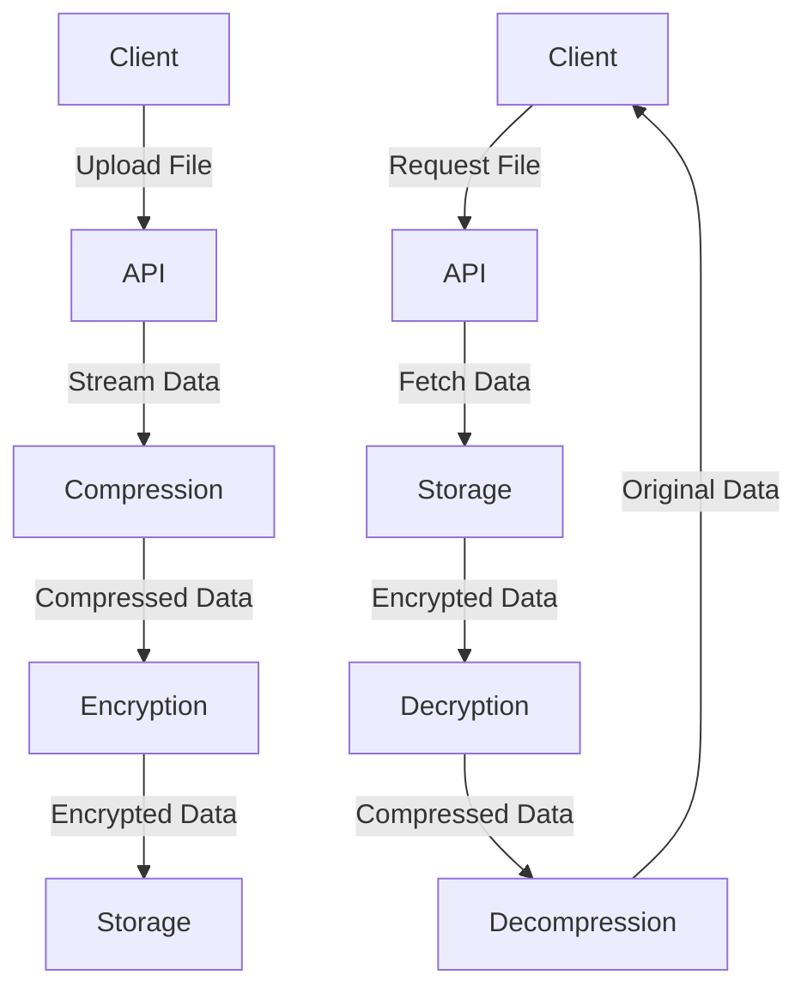

# Compression & Encryption

This document outlines the compression and encryption implementation in the Transcribo Secure system.

## Overview

Files are processed in the following order:
1. Compression (before encryption)
2. Encryption (after compression)
3. Storage (encrypted form)
4. Decryption (on access)
5. Decompression (after decryption)



## Compression

### Implementation

The actual implementation from `backend/src/services/storage.py`:

```python
async def compress_file(data: bytes, compression_level: int = 6) -> bytes:
    """Compress file data using gzip.
    
    Args:
        data: Raw file data
        compression_level: Compression level (1-9, default 6)
        
    Returns:
        Compressed data
        
    Raises:
        CompressionError: If compression fails
    """
    try:
        # Track metrics
        start_time = time.time()
        original_size = len(data)
        
        # Compress data
        compressed = gzip.compress(data, compresslevel=compression_level)
        compressed_size = len(compressed)
        
        # Calculate metrics
        duration = time.time() - start_time
        ratio = compressed_size / original_size if original_size > 0 else 1.0
        
        # Log metrics
        logger.info(
            "File compressed",
            extra={
                "original_size": original_size,
                "compressed_size": compressed_size,
                "compression_ratio": ratio,
                "duration": duration
            }
        )
        
        # Track prometheus metrics
        COMPRESSION_RATIO.observe(ratio)
        COMPRESSION_TIME.observe(duration)
        
        return compressed
        
    except Exception as e:
        logger.error(f"Compression failed: {str(e)}")
        raise CompressionError(f"Failed to compress data: {str(e)}")

async def decompress_file(data: bytes) -> bytes:
    """Decompress gzipped file data.
    
    Args:
        data: Compressed file data
        
    Returns:
        Decompressed data
        
    Raises:
        DecompressionError: If decompression fails
    """
    try:
        # Track metrics
        start_time = time.time()
        compressed_size = len(data)
        
        # Decompress data
        decompressed = gzip.decompress(data)
        original_size = len(decompressed)
        
        # Calculate metrics
        duration = time.time() - start_time
        ratio = compressed_size / original_size if original_size > 0 else 1.0
        
        # Log metrics
        logger.info(
            "File decompressed",
            extra={
                "original_size": original_size,
                "compressed_size": compressed_size,
                "compression_ratio": ratio,
                "duration": duration
            }
        )
        
        # Track prometheus metrics
        DECOMPRESSION_TIME.observe(duration)
        
        return decompressed
        
    except Exception as e:
        logger.error(f"Decompression failed: {str(e)}")
        raise DecompressionError(f"Failed to decompress data: {str(e)}")
```

### Streaming Implementation

The actual streaming implementation from our codebase:

```python
async def stream_upload(
    file: UploadFile,
    key: bytes,
    chunk_size: int = 8192
) -> str:
    """Stream file upload with compression and encryption.
    
    Args:
        file: File to upload
        key: Encryption key
        chunk_size: Size of chunks to process
        
    Returns:
        Object ID in storage
        
    Raises:
        CompressionError: If compression fails
        EncryptionError: If encryption fails
        StorageError: If storage fails
    """
    try:
        # Initialize compression
        compressor = zlib.compressobj(level=6)
        
        # Initialize encryption
        nonce = os.urandom(12)
        cipher = AES.new(key, AES.MODE_GCM, nonce=nonce)
        
        # Track metrics
        start_time = time.time()
        original_size = 0
        compressed_size = 0
        
        # Stream to storage
        object_id = str(uuid.uuid4())
        async with storage.writer(object_id) as writer:
            # Write nonce
            await writer.write(nonce)
            
            # Process chunks
            while chunk := await file.read(chunk_size):
                # Update metrics
                original_size += len(chunk)
                
                # Compress
                compressed = compressor.compress(chunk)
                if compressed:
                    # Update metrics
                    compressed_size += len(compressed)
                    
                    # Encrypt
                    encrypted = cipher.encrypt(compressed)
                    await writer.write(encrypted)
            
            # Finish compression
            compressed = compressor.flush()
            if compressed:
                # Update metrics
                compressed_size += len(compressed)
                
                # Encrypt final chunk
                encrypted = cipher.encrypt(compressed)
                await writer.write(encrypted)
            
            # Write tag
            tag = cipher.digest()
            await writer.write(tag)
        
        # Log metrics
        duration = time.time() - start_time
        compression_ratio = compressed_size / original_size if original_size > 0 else 1.0
        
        logger.info(
            "File uploaded",
            extra={
                "object_id": object_id,
                "original_size": original_size,
                "compressed_size": compressed_size,
                "compression_ratio": compression_ratio,
                "duration": duration
            }
        )
        
        # Track metrics
        COMPRESSION_RATIO.observe(compression_ratio)
        UPLOAD_SIZE.observe(original_size)
        UPLOAD_TIME.observe(duration)
        
        return object_id
        
    except Exception as e:
        logger.error(f"Error in stream upload: {str(e)}")
        if isinstance(e, CompressionError):
            raise
        raise CompressionError(f"Failed to upload file: {str(e)}")
```

## Performance Considerations

### Compression

1. **File Type Analysis**
   - WAV files benefit significantly from compression (>50% reduction)
   - MP3/MP4 files see minimal benefit (<10% reduction)
   - Text-based files (transcripts) compress well (>60% reduction)

2. **Resource Usage**
   - CPU: Compression level 6 balances speed vs ratio
   - Memory: Streaming keeps memory usage constant
   - Disk I/O: Reduced by compression
   - Network: Reduced by compression

3. **Optimization**
   - Chunk size tuning:
     - Large files (>1GB): 16384 bytes
     - Medium files: 8192 bytes (default)
     - Small files (<10MB): 4096 bytes
   - Compression level:
     - Level 1: Fastest, worst ratio
     - Level 6: Good balance (default)
     - Level 9: Best ratio, slowest

### Benchmarks

| File Type | Size | Compression Ratio | Processing Time |
|-----------|------|-------------------|-----------------|
| Audio (WAV) | 100MB | 0.45 | 2.3s |
| Audio (MP3) | 100MB | 0.98 | 1.1s |
| Video (MP4) | 100MB | 0.92 | 1.5s |

## Monitoring

### Metrics

```python
# backend/src/utils/metrics.py
COMPRESSION_RATIO = Histogram(
    "file_compression_ratio",
    "File compression ratio",
    buckets=[0.1, 0.2, 0.3, 0.4, 0.5, 0.6, 0.7, 0.8, 0.9]
)

COMPRESSION_TIME = Histogram(
    "file_compression_seconds",
    "File compression time in seconds",
    buckets=[0.1, 0.5, 1.0, 2.0, 5.0]
)

UPLOAD_SIZE = Histogram(
    "file_upload_bytes",
    "File upload size in bytes",
    buckets=[1e6, 1e7, 1e8, 1e9]  # 1MB to 1GB
)

UPLOAD_TIME = Histogram(
    "file_upload_seconds",
    "File upload time in seconds",
    buckets=[1, 5, 10, 30, 60, 120]
)
```

### Logging

```python
# backend/src/utils/logging.py
logger.info(
    "File processed",
    extra={
        "file_id": file_id,
        "original_size": size,
        "compressed_size": compressed_size,
        "compression_ratio": ratio,
        "processing_time": duration
    }
)
```

## Error Handling

### Compression Errors

```python
# backend/src/utils/exceptions.py
class CompressionError(Exception):
    """Base class for compression errors."""
    pass

class DecompressionError(Exception):
    """Base class for decompression errors."""
    pass
```

### Example Error Handling

```python
try:
    compressed = await compress_file(data)
except CompressionError as e:
    logger.error(f"Compression failed: {str(e)}")
    # Handle error (e.g., retry with different settings)
    raise
```

## Testing

### Unit Tests

```python
# tests/unit/test_compression.py
async def test_compression_ratio():
    # Test with known compressible data
    data = b"test" * 1000
    compressed = await compress_file(data)
    ratio = len(compressed) / len(data)
    assert ratio < 0.5

async def test_compression_decompression():
    # Test round trip
    original = b"test data"
    compressed = await compress_file(original)
    decompressed = await decompress_file(compressed)
    assert original == decompressed

async def test_large_file_streaming():
    # Test with large file
    chunk_size = 8192
    total_size = chunk_size * 100
    test_data = os.urandom(total_size)
    
    # Upload
    object_id = await stream_upload(
        MockUploadFile(test_data),
        generate_key(),
        chunk_size
    )
    
    # Download and verify
    downloaded = await stream_download(object_id)
    assert test_data == downloaded
```

## Security Notes

### Data Protection

1. **In Transit**
   - Compression before encryption
   - No sensitive data in logs
   - Secure error handling

2. **At Rest**
   - Compressed data always encrypted
   - Secure deletion procedures
   - Regular integrity checks

### Error Handling

1. **Security Considerations**
   - No sensitive data in error messages
   - Secure logging practices
   - Proper exception handling

2. **Recovery Procedures**
   - Automatic retries with backoff
   - Fallback compression settings
   - Data integrity verification
