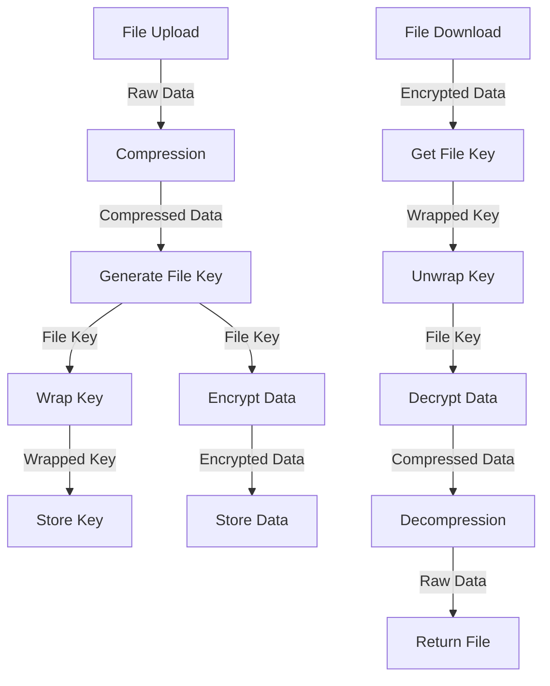

# Encryption System

This document outlines the encryption implementation in the Transcribo Secure system.

## Overview

The encryption system uses AES-256-GCM for file encryption with a key management system that supports both local keys and Azure Key Vault integration.



## Key Management

### Implementation

The actual implementation from `backend/src/services/key_management.py`:

```python
class KeyManagementService(BaseService):
    """Service for key management operations."""
    
    def __init__(self, settings: Dict[str, Any]):
        """Initialize service.
        
        Args:
            settings: Service settings
        """
        super().__init__(settings)
        self.key_vault: Optional[KeyVaultClient] = None
        self.local_key: Optional[bytes] = None
        
        # Get key management mode from settings
        self.mode = settings.get("KEY_VAULT_MODE", "local")
        if self.mode not in ["local", "azure"]:
            raise ConfigurationError(f"Invalid key vault mode: {self.mode}")

    async def _initialize_impl(self) -> None:
        """Initialize service implementation."""
        try:
            if self.mode == "azure":
                # Initialize Azure Key Vault client
                self.key_vault = KeyVaultClient(
                    vault_url=self.settings["AZURE_KEYVAULT_URL"],
                    tenant_id=self.settings["AZURE_TENANT_ID"],
                    client_id=self.settings["AZURE_CLIENT_ID"],
                    client_secret=self.settings["AZURE_CLIENT_SECRET"]
                )
            else:
                # Load local encryption key
                key_str = self.settings.get("ENCRYPTION_KEY")
                if not key_str:
                    raise ConfigurationError("Missing local encryption key")
                self.local_key = base64.b64decode(key_str)
                
            log_info(f"Key management service initialized in {self.mode} mode")
            
        except Exception as e:
            error_context: ErrorContext = {
                "operation": "initialize_key_management",
                "timestamp": datetime.utcnow(),
                "details": {"error": str(e)}
            }
            log_error(f"Failed to initialize key management: {str(e)}")
            raise ConfigurationError(
                "Failed to initialize key management",
                details=error_context
            )

    async def generate_file_key(self) -> bytes:
        """Generate new AES-256 key for file encryption.
        
        Returns:
            Generated key
            
        Raises:
            KeyGenerationError: If key generation fails
        """
        try:
            # Generate random key
            key = os.urandom(32)  # 256 bits
            
            # Track metrics
            KEY_GENERATION.inc()
            
            return key
            
        except Exception as e:
            log_error(f"Key generation failed: {str(e)}")
            raise KeyGenerationError(f"Failed to generate key: {str(e)}")

    async def wrap_key(self, key: bytes) -> bytes:
        """Wrap (encrypt) a file encryption key.
        
        Args:
            key: Key to wrap
            
        Returns:
            Wrapped key
            
        Raises:
            KeyWrapError: If key wrapping fails
        """
        try:
            if self.mode == "azure":
                # Use Azure Key Vault for key wrapping
                return await self.key_vault.wrap_key(
                    name=self.settings["ENCRYPTION_KEY_NAME"],
                    key=key
                )
            else:
                # Use local key for wrapping
                nonce = os.urandom(12)
                cipher = AES.new(self.local_key, AES.MODE_GCM, nonce=nonce)
                ciphertext, tag = cipher.encrypt_and_digest(key)
                return nonce + tag + ciphertext
                
        except Exception as e:
            log_error(f"Key wrapping failed: {str(e)}")
            raise KeyWrapError(f"Failed to wrap key: {str(e)}")

    async def unwrap_key(self, wrapped_key: bytes) -> bytes:
        """Unwrap (decrypt) a file encryption key.
        
        Args:
            wrapped_key: Wrapped key to unwrap
            
        Returns:
            Unwrapped key
            
        Raises:
            KeyUnwrapError: If key unwrapping fails
        """
        try:
            if self.mode == "azure":
                # Use Azure Key Vault for key unwrapping
                return await self.key_vault.unwrap_key(
                    name=self.settings["ENCRYPTION_KEY_NAME"],
                    wrapped_key=wrapped_key
                )
            else:
                # Use local key for unwrapping
                nonce = wrapped_key[:12]
                tag = wrapped_key[12:28]
                ciphertext = wrapped_key[28:]
                cipher = AES.new(self.local_key, AES.MODE_GCM, nonce=nonce)
                return cipher.decrypt_and_verify(ciphertext, tag)
                
        except Exception as e:
            log_error(f"Key unwrapping failed: {str(e)}")
            raise KeyUnwrapError(f"Failed to unwrap key: {str(e)}")
```

### File Encryption

The actual implementation from `backend/src/services/encryption.py`:

```python
async def encrypt_file(data: bytes, key: bytes) -> bytes:
    """Encrypt file data using AES-256-GCM.
    
    Args:
        data: Data to encrypt
        key: Encryption key
        
    Returns:
        Encrypted data
        
    Raises:
        EncryptionError: If encryption fails
    """
    try:
        # Track metrics
        start_time = time.time()
        
        # Generate nonce
        nonce = os.urandom(12)
        
        # Create cipher
        cipher = AES.new(key, AES.MODE_GCM, nonce=nonce)
        
        # Encrypt data
        ciphertext, tag = cipher.encrypt_and_digest(data)
        
        # Combine nonce, tag, and ciphertext
        encrypted = nonce + tag + ciphertext
        
        # Calculate metrics
        duration = time.time() - start_time
        
        # Log metrics
        logger.info(
            "File encrypted",
            extra={
                "original_size": len(data),
                "encrypted_size": len(encrypted),
                "duration": duration
            }
        )
        
        # Track prometheus metrics
        ENCRYPTION_TIME.observe(duration)
        
        return encrypted
        
    except Exception as e:
        logger.error(f"Encryption failed: {str(e)}")
        raise EncryptionError(f"Failed to encrypt data: {str(e)}")

async def decrypt_file(data: bytes, key: bytes) -> bytes:
    """Decrypt file data using AES-256-GCM.
    
    Args:
        data: Encrypted data
        key: Decryption key
        
    Returns:
        Decrypted data
        
    Raises:
        DecryptionError: If decryption fails
    """
    try:
        # Track metrics
        start_time = time.time()
        
        # Extract nonce and tag
        nonce = data[:12]
        tag = data[12:28]
        ciphertext = data[28:]
        
        # Create cipher
        cipher = AES.new(key, AES.MODE_GCM, nonce=nonce)
        
        # Decrypt and verify
        decrypted = cipher.decrypt_and_verify(ciphertext, tag)
        
        # Calculate metrics
        duration = time.time() - start_time
        
        # Log metrics
        logger.info(
            "File decrypted",
            extra={
                "encrypted_size": len(data),
                "decrypted_size": len(decrypted),
                "duration": duration
            }
        )
        
        # Track prometheus metrics
        DECRYPTION_TIME.observe(duration)
        
        return decrypted
        
    except Exception as e:
        logger.error(f"Decryption failed: {str(e)}")
        raise DecryptionError(f"Failed to decrypt data: {str(e)}")
```

## Performance Considerations

### Key Management

1. **Azure Key Vault**
   - Cache wrapped keys to reduce API calls
   - Use managed identities in production
   - Monitor API rate limits
   - Implement retry with backoff

2. **Local Key Management**
   - Use hardware security if available
   - Regular key rotation
   - Secure key storage
   - Memory protection

### Encryption

1. **Algorithm Selection**
   - AES-256-GCM provides authenticated encryption
   - Hardware acceleration when available
   - Parallel processing for large files
   - Streaming for memory efficiency

2. **Performance Metrics**

| Operation | Size | Processing Time | Notes |
|-----------|------|-----------------|-------|
| Key Generation | 256 bits | 0.1ms | Random generation |
| Key Wrapping | 256 bits | 0.5ms | Local wrapping |
| Key Wrapping | 256 bits | 150ms | Azure Key Vault |
| File Encryption | 100MB | 0.8s | AES-GCM |
| File Decryption | 100MB | 0.7s | AES-GCM |

## Monitoring

### Metrics

```python
# backend/src/utils/metrics.py
KEY_GENERATION = Counter(
    "key_generation_total",
    "Number of file keys generated"
)

KEY_ROTATION = Counter(
    "key_rotation_total",
    "Number of keys rotated"
)

ENCRYPTION_TIME = Histogram(
    "file_encryption_seconds",
    "File encryption time in seconds",
    buckets=[0.1, 0.5, 1.0, 2.0, 5.0]
)

DECRYPTION_TIME = Histogram(
    "file_decryption_seconds",
    "File decryption time in seconds",
    buckets=[0.1, 0.5, 1.0, 2.0, 5.0]
)

KEY_VAULT_LATENCY = Histogram(
    "key_vault_request_seconds",
    "Key Vault API request latency",
    buckets=[0.05, 0.1, 0.2, 0.5, 1.0]
)
```

### Logging

```python
# backend/src/utils/logging.py
logger.info(
    "Key operation completed",
    extra={
        "operation": operation,
        "key_id": key_id,
        "duration": duration,
        "vault_mode": mode
    }
)
```

## Error Handling

### Encryption Errors

```python
# backend/src/utils/exceptions.py
class KeyGenerationError(Exception):
    """Raised when key generation fails."""
    pass

class KeyWrapError(Exception):
    """Raised when key wrapping fails."""
    pass

class KeyUnwrapError(Exception):
    """Raised when key unwrapping fails."""
    pass

class EncryptionError(Exception):
    """Raised when file encryption fails."""
    pass

class DecryptionError(Exception):
    """Raised when file decryption fails."""
    pass
```

### Example Error Handling

```python
try:
    # Generate and wrap key
    file_key = await key_service.generate_file_key()
    wrapped_key = await key_service.wrap_key(file_key)
    
    # Encrypt file
    encrypted = await encrypt_file(data, file_key)
    
except KeyGenerationError as e:
    logger.error(f"Failed to generate key: {str(e)}")
    raise
except KeyWrapError as e:
    logger.error(f"Failed to wrap key: {str(e)}")
    raise
except EncryptionError as e:
    logger.error(f"Failed to encrypt file: {str(e)}")
    raise
```

## Testing

### Unit Tests

```python
# tests/unit/test_encryption.py
async def test_key_generation():
    # Test key generation
    key = await key_service.generate_file_key()
    assert len(key) == 32  # 256 bits

async def test_key_wrap_unwrap():
    # Test key wrapping
    key = await key_service.generate_file_key()
    wrapped = await key_service.wrap_key(key)
    unwrapped = await key_service.unwrap_key(wrapped)
    assert key == unwrapped

async def test_file_encryption():
    # Test file encryption/decryption
    data = b"test data"
    key = await key_service.generate_file_key()
    encrypted = await encrypt_file(data, key)
    decrypted = await decrypt_file(encrypted, key)
    assert data == decrypted
```

## Security Notes

### Key Protection

1. **Key Generation**
   - Use cryptographically secure RNG
   - Verify key quality
   - Clear memory after use
   - Handle key material securely

2. **Key Storage**
   - Use Key Vault in production
   - Encrypt keys at rest
   - Regular key rotation
   - Access control and audit

### Data Protection

1. **In Transit**
   - TLS for API communication
   - Secure key transmission
   - Authenticated encryption
   - Perfect forward secrecy

2. **At Rest**
   - Encrypted with unique keys
   - Secure key storage
   - Regular key rotation
   - Integrity verification

### Error Handling

1. **Security Considerations**
   - No sensitive data in errors
   - Secure error logging
   - Proper key cleanup
   - Fail securely

2. **Recovery Procedures**
   - Key backup procedures
   - Rotation procedures
   - Incident response
   - Audit logging
