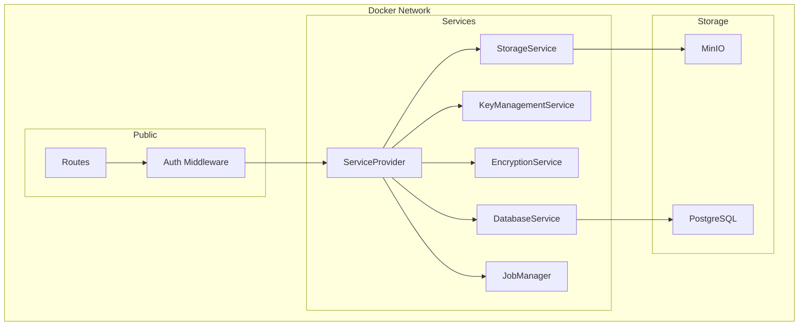
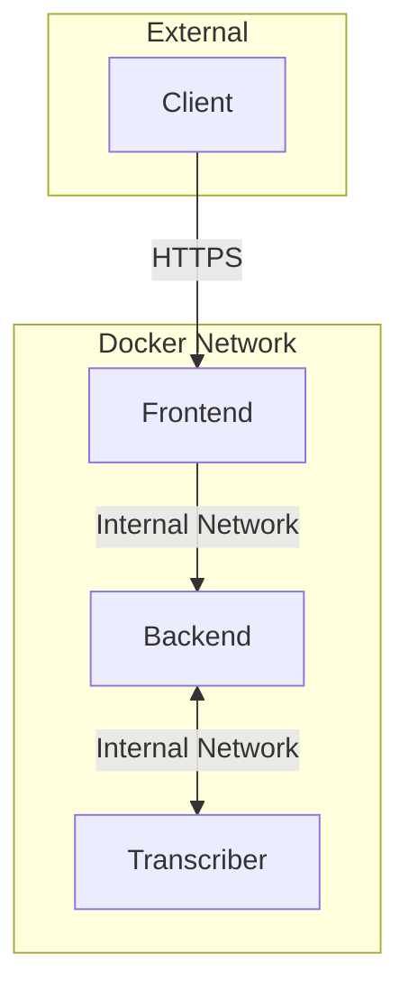
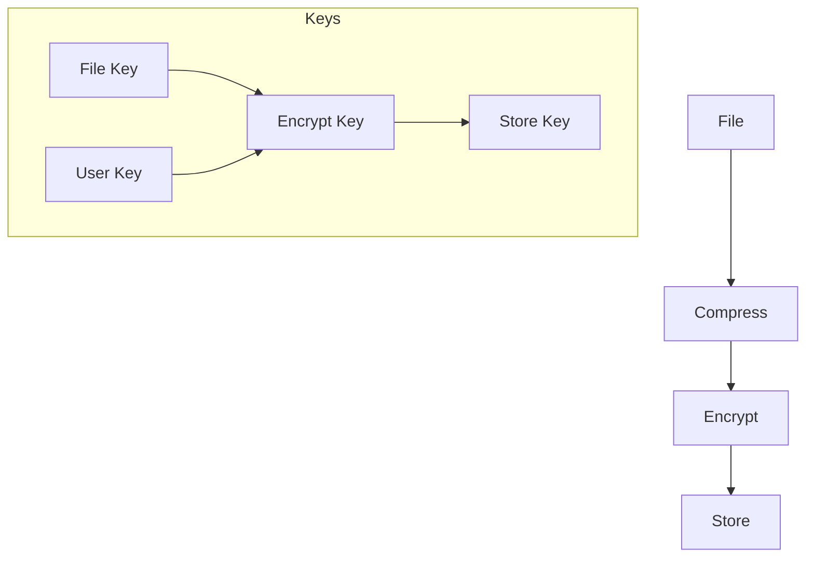
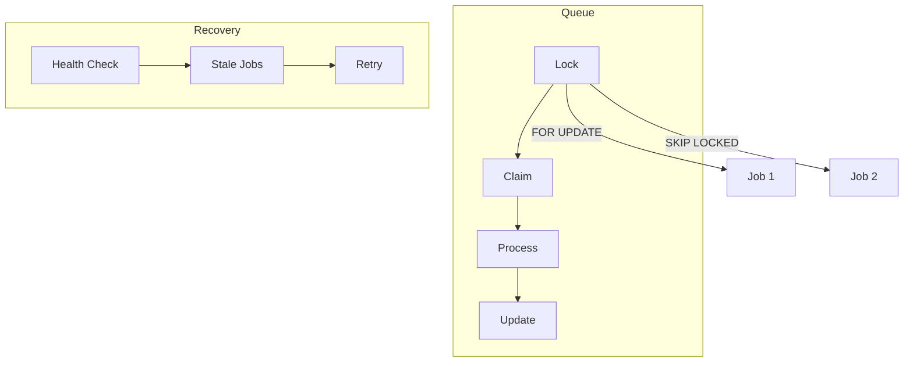

# Security Documentation

## Architecture Security

### Service Boundaries


### Security Layers

1. Network Layer
   - Docker network isolation
   - Container-to-container communication
   - External TLS termination
   - Network segmentation

2. Authentication Layer
   - JWT-based authentication
   - Token validation
   - Role-based access control
   - Secure token storage

3. Service Layer
   - Interface-based design
   - Service validation
   - Dependency injection
   - Error handling

4. Encryption Layer
   - End-to-end encryption
   - Key management
   - File key sharing
   - Secure key storage

5. Storage Layer
   - Encrypted storage
   - Access control
   - Secure file deletion
   - Bucket isolation

## Container Security

### Network Security


1. Docker Network
   - Isolated network namespace
   - Internal DNS resolution
   - Container-to-container routing
   - Network policy enforcement

2. Communication
   - Internal traffic stays within Docker network
   - No exposure to external networks
   - Service authentication via tokens
   - Request validation

3. External Access
   - TLS termination at edge
   - HTTPS for all external traffic
   - Certificate management
   - CORS configuration

## File Security

### Encryption Process


1. File Processing
   - Validate file type and size
   - Compress before encryption
   - Generate unique file key
   - Encrypt with file key
   - Store encrypted data

2. Key Management
   - Generate random file keys
   - Encrypt file keys with user keys
   - Store encrypted keys in database
   - Secure key sharing

3. Access Control
   - Owner-based access
   - Key-based sharing
   - Permission validation
   - Audit logging

## Job Security

### Job Queue Security


1. Job Claiming
   - Distributed locking
   - FOR UPDATE SKIP LOCKED
   - Worker validation
   - Timeout handling

2. Job Processing
   - Worker authentication
   - Progress tracking
   - Error handling
   - Automatic recovery

3. Job Recovery
   - Health monitoring
   - Stale job detection
   - Automatic retry
   - Exponential backoff

## Data Protection

### User Data
- Personal data encryption
- Secure data deletion
- Access logging
- Data isolation

### File Data
- End-to-end encryption
- Secure key management
- Access control
- Secure deletion

### Job Data
- Job isolation
- Progress protection
- Result encryption
- Audit logging

## Monitoring & Auditing

### Security Metrics
- Authentication failures
- Access attempts
- Job failures
- Storage usage

### Audit Logging
- Access logs
- Operation logs
- Error logs
- Security events

### Health Monitoring
- Service health
- Worker health
- Storage health
- Database health

## Configuration Security

### Environment Variables
```bash
# Required
POSTGRES_PASSWORD=<secure_password>
MINIO_ACCESS_KEY=<access_key>
MINIO_SECRET_KEY=<secret_key>

# Optional with secure defaults
POSTGRES_HOST=localhost
POSTGRES_PORT=5432
MINIO_HOST=localhost
MINIO_PORT=9000
```

### Service Configuration
- Secure defaults
- Configuration validation
- Secret management
- Error handling

## Development Security

### Code Security
- Interface-based design
- Type safety
- Error handling
- Input validation

### Testing
- Security tests
- Concurrency tests
- Error tests
- Recovery tests

### Deployment
- Secure builds
- Container security
- Network isolation
- Health monitoring

## Incident Response

### Detection
- Error monitoring
- Security alerts
- Health checks
- Audit logs

### Recovery
- Automatic recovery
- Job retry
- Worker failover
- Data protection

### Reporting
- Error logging
- Security events
- Audit trails
- Metrics tracking
