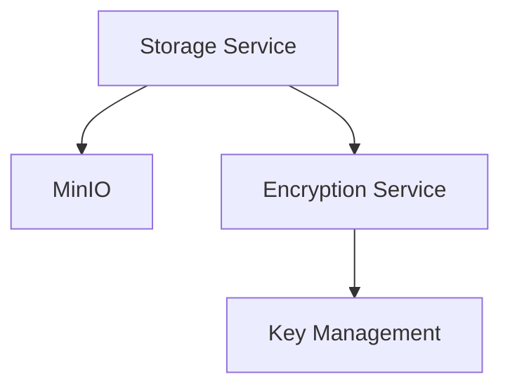
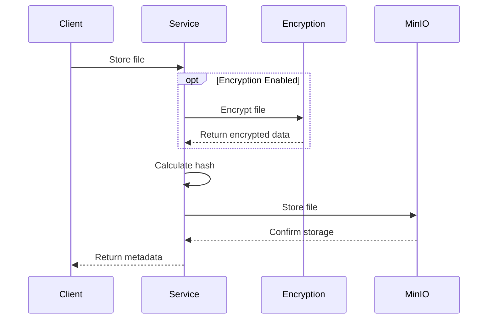

# Storage Guide

This document describes the storage system in Transcribo.

## Overview

Transcribo uses MinIO for secure file storage with the following features:

1. File Storage
   - Secure file storage with MinIO
   - Automatic encryption
   - File integrity verification
   - Streaming support for large files

2. Integration
   - Configuration-based setup
   - Integration with encryption service
   - Comprehensive error handling
   - Metrics tracking

## Configuration

Storage settings are defined in the `.env` file:

```env
# Storage settings
STORAGE_ENDPOINT=minio
STORAGE_PORT=9000
STORAGE_ACCESS_KEY=your_access_key_here
STORAGE_SECRET_KEY=your_secret_key_here
STORAGE_SECURE=false
STORAGE_REGION=us-east-1
STORAGE_BUCKET=transcribo
STORAGE_ENCRYPTION_ENABLED=true
STORAGE_MAX_FILE_SIZE=104857600  # 100MB
STORAGE_ALLOWED_EXTENSIONS=.mp3,.wav,.m4a
```

## Architecture

The storage system consists of three main components:



1. **Storage Service**
   - File operations (store, get, delete)
   - Streaming support
   - Metadata management
   - Error handling

2. **MinIO Integration**
   - Secure object storage
   - Bucket management
   - Server-side encryption
   - Versioning support

3. **Encryption Integration**
   - Automatic file encryption
   - Key management
   - Hash verification
   - Integrity checks

## File Storage Flow



## Usage Example

```python
# Store a file
async with open('input.mp3', 'rb') as file:
    metadata = await storage_service.store_file(
        file_id=file_id,
        file=file,
        metadata={'content_type': 'audio/mp3'},
        encrypt=True  # Optional, defaults to config
    )

# Get a file
file_data, metadata = await storage_service.get_file(
    file_id=file_id,
    decrypt=True  # Optional, defaults to True if encrypted
)

# Delete a file
deleted = await storage_service.delete_file(file_id=file_id)

# Get file info
info = await storage_service.get_file_info(file_id=file_id)

# Get file size
size = await storage_service.get_file_size(file_id=file_id)
```

## Error Handling

Storage operations can raise:

1. `StorageError`
   - Base class for storage errors
   - Contains operation context
   - Includes error details

2. `StorageAuthenticationError`
   - MinIO authentication failures
   - Access denied errors

3. `StorageConnectionError`
   - MinIO connection issues
   - Network problems

4. `StorageOperationError`
   - Operation-specific failures
   - Bucket configuration errors

5. `StorageQuotaError`
   - Storage quota exceeded
   - Resource limits reached

6. `StorageFileSizeError`
   - File size exceeds limit
   - Chunk size issues

7. `StorageFileNotFoundError`
   - File not found in storage
   - Invalid file ID

8. `StorageFileCorruptedError`
   - Hash verification failures
   - Data integrity issues

9. `StorageMetadataError`
   - Metadata retrieval failures
   - Invalid metadata format

All errors include:
- Operation context
- Timestamp
- Error details
- File ID (where applicable)

## Metrics

The storage system tracks:

1. Operations
   - Store/get/delete counts
   - Operation latency
   - Error rates

2. File Sizes
   - Total storage used
   - File size distribution
   - Encryption overhead

3. Performance
   - Operation duration
   - Encryption time
   - Network latency

4. Errors
   - Error types
   - Error frequency
   - Error context

## Security Considerations

1. File Storage
   - Automatic encryption
   - Hash verification
   - Secure file paths
   - Access control

2. MinIO Security
   - TLS encryption
   - Access key authentication
   - Bucket policies
   - Server-side encryption

3. Error Handling
   - Secure error messages
   - No sensitive data in logs
   - Proper cleanup on failure

4. Performance
   - Streaming for large files
   - Efficient encryption
   - Resource cleanup

## Development Setup

1. Create a `.env` file based on `.env.example`
2. Configure storage settings:
   ```env
   STORAGE_ENDPOINT=minio
   STORAGE_PORT=9000
   STORAGE_ACCESS_KEY=your_access_key_here
   STORAGE_SECRET_KEY=your_secret_key_here
   STORAGE_SECURE=false
   STORAGE_REGION=us-east-1
   STORAGE_BUCKET=transcribo
   ```

3. Configure encryption:
   ```env
   STORAGE_ENCRYPTION_ENABLED=true
   STORAGE_MAX_FILE_SIZE=104857600
   STORAGE_ALLOWED_EXTENSIONS=.mp3,.wav,.m4a
   ```

4. Start the application:
   ```bash
   docker-compose up
   ```

## Testing

The storage system includes:

1. Unit Tests
   - File operations
   - Error handling
   - Configuration validation

2. Integration Tests
   - End-to-end flows
   - MinIO integration
   - Encryption integration

3. Performance Tests
   - Large file handling
   - Concurrent operations
   - Resource usage

## Monitoring

Monitor storage operations through:

1. Logs
   - Operation status
   - Error details
   - Performance metrics

2. Metrics
   - Operation counts
   - Error rates
   - Storage usage

3. Alerts
   - Error thresholds
   - Storage capacity
   - Performance degradation
